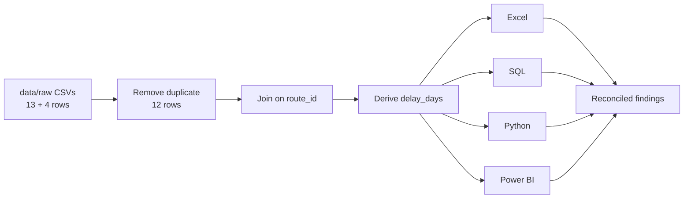
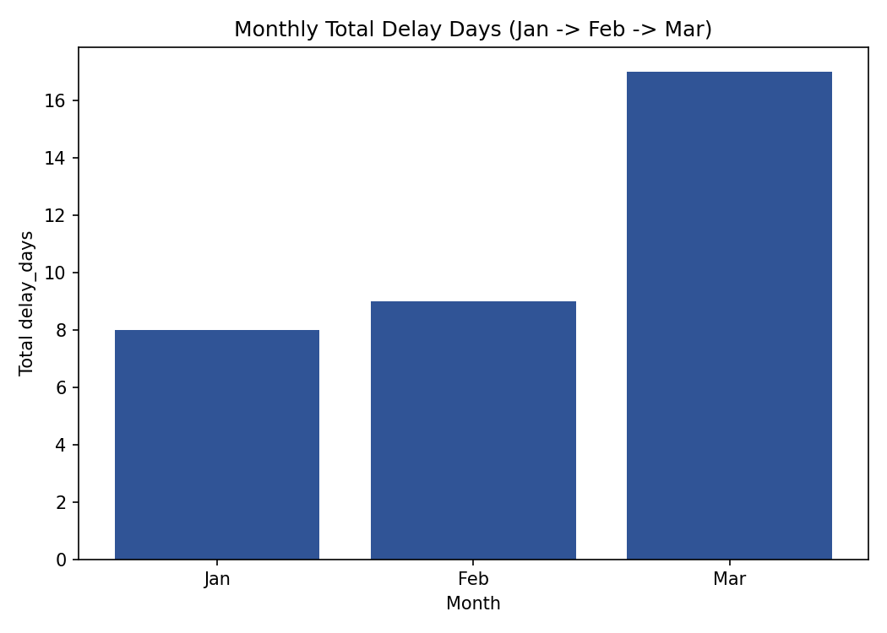

# 🚚 Delivery Delay Analysis — Set A

### `data-analysis-set-a-11277`


| | |
|---|---|
| 👩‍🎓 **Student** | Janavi Gol |
| 🆔 **Student ID** | 11277 |
| 📝 **Assigned Set** | **Set A** — Delivery Delay Analysis |
| 🏫 **Exam** | Red & White Skill Education — Data Analysis Practical Exam |
| 🧰 **Modules** | Excel • Power BI • SQL • Python |

> ℹ️ **Repository naming note:** the exam paper (Section C) names the pattern `data-analysis-set-d-YOUR-STUDENT-ID` although the paper is titled Set A throughout. This looks like a template copy-paste artifact, so this repo uses `set-a` to match the assigned set. The invigilator can confirm the expected name.

---

## 📑 Table of Contents

1. [Business Objective](#1--business-objective)
2. [Key Results at a Glance](#2--key-results-at-a-glance)
3. [Dataset & Data Dictionary](#3--dataset--data-dictionary)
4. [Cleaning Steps & Metric Definitions](#4--cleaning-steps--metric-definitions)
5. [Tools & Versions](#5--tools--versions)
6. [Project Folder Structure](#6--project-folder-structure)
7. [Excel Sheet Guide](#7--excel-sheet-guide)
8. [SQL Setup & Execution](#8--sql-setup--execution)
9. [Python Setup & Run](#9--python-setup--run)
10. [Power BI Dashboard & Refresh Steps](#10--power-bi-dashboard--refresh-steps)
11. [Findings & Recommendation](#11--findings--recommendation)
12. [Cross-Tool Reconciliation](#12--cross-tool-reconciliation)
13. [Video Walkthrough](#13--video-walkthrough)
14. [References](#14--references)
15. [Authorship Declaration](#15--authorship-declaration)

---

## 1. 🎯 Business Objective

**Business question:** *Which service type has the greatest delivery-delay burden, and which hub needs priority attention?*

This project answers two questions, using the same 12 clean records in all four tools:

1. **Service type:** Which service type (Express vs Standard) carries the greatest cumulative delay burden, and which route drives it?
2. **Hub:** Which hub (Mumbai, Delhi, Chennai) accumulates the most `delay_days` and needs priority operational attention?



---

## 2. 📌 Key Results at a Glance

| Metric | Value |
|---|---|
| 📦 Delivery Count (clean) | **12** |
| ⏱️ Total Delay Days | **34.00** |
| 📈 Delay Incidence Rate | **75.00%** (9 of 12) |
| 🏆 Highest-delay service type | **Standard** (22.00 days) |
| 📍 Highest-delay hub | **Mumbai** (15.00 days) |
| 🛣️ Worst route | **R4 – Rural Feeder** (14.00 days, **41.18%** of total) |

---

## 3. 🗂️ Dataset & Data Dictionary

Two synthetic CSV files supplied by the exam, stored in `data/raw/`. Raw values are preserved unchanged.

### `data/raw/deliveries.csv` — fact table (13 raw rows, 1 exact duplicate)

| Column | Type | Meaning |
|---|---|---|
| `record_id` | integer | Delivery record identifier |
| `month` | text (ordered: Jan → Feb → Mar) | Month of the record |
| `route_id` | text | Foreign key to `routes.route_id` |
| `hub` | text | Delivery hub: Mumbai / Chennai / Delhi |
| `promised_days` | number | Promised delivery time in days |
| `actual_days` | number | Actual delivery time in days |

### `data/raw/routes.csv` — lookup table (4 rows)

| Column | Type | Meaning |
|---|---|---|
| `route_id` | text | Primary key |
| `route` | text | Route name |
| `service_type` | text | Express / Standard |

> One `routes` row maps to many `deliveries` rows (key: `route_id`). Each delivery row is a **month-end route/hub summary**, so summed `delay_days` is cumulative record-level delay, **not** the number of unique parcels to expedite today.

---

## 4. 🧹 Cleaning Steps & Metric Definitions

**Duplicate handling:** the raw file has 13 rows. The last row (`12, Mar, R4, Mumbai, 6, 15`) is an exact duplicate and is removed in every module, leaving **12 unique records**.

| Tool | How the duplicate is removed |
|---|---|
| Excel | `Clean` sheet holds 12 rows; before/after counts (13 → 12) shown |
| SQL | `setup.sql` loads exactly 12 fact rows + 4 lookup rows |
| Python | `drop_duplicates()` then assert 12 rows after merge |
| Power BI | Power Query → *Remove Duplicates* on the deliveries query |

**Metric definitions**

| Metric | Definition |
|---|---|
| `delay_days` | `MAX(actual_days − promised_days, 0)` — zero when on time or early |
| Delay Incidence Rate | records where `actual_days > promised_days` ÷ all records, shown as a percentage |

Other rules: rates are calculated from underlying counts (never by averaging subgroup percentages); `month` order Jan → Feb → Mar is preserved in all charts and pivots; results use two decimals; ties for highest/lowest are all reported.

---

## 5. 🛠️ Tools & Versions

| Tool | Version |
|---|---|
| Microsoft Excel | `<<fill in, e.g. Microsoft 365>>` |
| Power BI Desktop | `<<fill in, e.g. 2.xxx.xxx>>` |
| SQL engine | **SQLite** `<<run: sqlite3 --version>>` |
| Python | `<<run: python --version>>` |
| pandas / matplotlib / openpyxl | see `requirements.txt` (`<<run: pip list>>`) |

---

## 6. 📁 Project Folder Structure

```
data-analysis-set-a-11277/
├── README.md
├── requirements.txt
├── .gitignore
├── data/
│   └── raw/
│       ├── deliveries.csv
│       └── routes.csv
├── excel/
│   └── analysis.xlsx
├── sql/
│   ├── setup.sql
│   └── queries.sql
├── python/
│   └── analysis.py
├── powerbi/
│   └── dashboard.pbix
└── outputs/
    ├── clean_data.csv
    ├── python_summary.csv
    ├── python_chart.png
    ├── powerbi_dashboard.png
    └── sql/
        ├── s2a_delay_by_service_type.csv
        ├── s2b_routes_significant_delay.csv
        ├── s2c_top_hubs_by_delay.csv
        └── diagnostic_unmatched_keys.csv
```

---

## 7. 📗 Excel Sheet Guide

File: `excel/analysis.xlsx` — all formulas are live and editable.

| Sheet | What it does |
|---|---|
| **Raw** | Original 13-row `deliveries.csv`, unchanged, with before row count (13) |
| **Lookup** | 4-row `routes.csv` |
| **Clean** | 12 de-duplicated rows, `service_type` via lookup on `route_id` (INDEX/MATCH), `delay_days` via `=MAX(actual_days-promised_days,0)`, before/after counts (13 → 12) |
| **Summary** | `SUMIFS` total `delay_days` by hub, Service Type × Month PivotTable (Jan → Feb → Mar) and a column chart with title, axis labels and legend |

---

## 8. 🗄️ SQL Setup & Execution

**Dialect:** SQLite `<<version>>` (also stated at the top of `sql/setup.sql`).

**Execution order** (run from repo root, `setup.sql` first):

```bash
sqlite3 outputs/delivery.db < sql/setup.sql      # 1) create tables + load 12 / 4 rows
sqlite3 outputs/delivery.db < sql/queries.sql    # 2) run S2a, S2b, S2c + diagnostic
```

| Step | Query | Purpose | Saved output |
|---|---|---|---|
| 1 | `setup.sql` | `CREATE TABLE` with PK/FK, load 12 fact + 4 lookup rows | — |
| 2 | **S2a** | Total delay_days by service type (descending) | `outputs/sql/s2a_delay_by_service_type.csv` |
| 3 | **S2b** | Routes with summed delay_days > 8 (`GROUP BY` + `HAVING`) | `outputs/sql/s2b_routes_significant_delay.csv` |
| 4 | **S2c** | Top two hubs by delay (alphabetical tie-break) | `outputs/sql/s2c_top_hubs_by_delay.csv` |
| 5 | **S3 diagnostic** | `LEFT JOIN` check, zero unmatched `route_id` expected | `outputs/sql/diagnostic_unmatched_keys.csv` |

> No `sqlite3` CLI? Run the same statements via Python's built-in `sqlite3` module or DB Browser for SQLite.

---

## 9. 🐍 Python Setup & Run

```bash
pip install -r requirements.txt
python python/analysis.py
```

Run from the **repository root**. All paths are relative, so the script works on another machine without edits.

The script:
- loads both CSVs and confirms numeric types
- removes the duplicate and left-joins on `route_id`
- asserts exactly 12 rows and zero unmatched keys (no NaN in `service_type`)
- derives `delay_days = (actual_days - promised_days).clip(lower=0)`
- builds the service-type summary (total delay and incidence rate) and finds the top route and its share of total
- saves `outputs/python_chart.png`, `outputs/clean_data.csv` and `outputs/python_summary.csv`



---

## 10. 📊 Power BI Dashboard & Refresh Steps

File: `powerbi/dashboard.pbix`


**Power Query & model**
- Both CSVs loaded as sources; data types set for all columns
- Exact duplicate removed from `deliveries` → 12 rows
- Relationship: `routes[route_id]` → `deliveries[route_id]`, one-to-many, active, single direction (routes filters deliveries)

**DAX measures** (in a dedicated `Measures` table)

```DAX
Delivery Count = COUNTROWS(deliveries)

Total Delay Days =
SUMX(deliveries, MAX(deliveries[actual_days] - deliveries[promised_days], 0))

Delay Incidence Rate =
DIVIDE(
    COUNTROWS(FILTER(deliveries, deliveries[actual_days] > deliveries[promised_days])),
    COUNTROWS(deliveries),
    0
)
```

**Report page:** 3 KPI cards, bar chart of Total Delay Days by service type, monthly trend (Jan → Feb → Mar), and a hub slicer that filters every card and chart.

**Slicer test**

| State | Delivery Count | Total Delay Days | Delay Incidence Rate |
|---|---|---|---|
| Hub = Mumbai | 4 | 15.00 | 75.00% |
| Unfiltered (cleared) | 12 | 34.00 | 75.00% |

**🔄 Refresh after cloning**
1. Data source files: `data/raw/deliveries.csv` and `data/raw/routes.csv`
2. Open `powerbi/dashboard.pbix` → **Transform data** → select each query → **Source** step
3. Change the file path to your local clone, for example `C:\...\data-analysis-set-a-11277\data\raw\deliveries.csv`
4. **Close & Apply**, then **Refresh**

---

## 11. 💡 Findings & Recommendation

1. **Standard carries the greatest delay burden:** 22.00 delay days vs 12.00 for Express. Standard's incidence rate is 83.33% (5 of 6) vs 66.67% (4 of 6) for Express. Overall incidence is **75.00%** (9 of 12).
2. **Mumbai needs priority attention:** 15.00 delay days, ahead of Delhi (14.00) and Chennai (5.00). Route **R4 – Rural Feeder** alone contributes **14.00 days, 41.18% of the 34.00 total**. Only R4 and R1 (9.00) exceed 8 delay days.

**✅ Recommendation:** review the **Rural Feeder (R4)** route first, since it is the largest single contributor and sits in the higher-delay Standard tier. Give the **Delhi** hub secondary attention as it is close behind Mumbai.

**⚠️ Limitation:** this is a very small synthetic sample (12 records, 3 months, 4 routes, 3 hubs), so findings show direction, not a statistically robust trend. Summed delay days are cumulative record-level delay, not unique parcels.

---

## 12. 🔗 Cross-Tool Reconciliation

**Aggregate checked:** total `delay_days` for the **Standard** service type.

| Tool | Where it was read | Value |
|---|---|---|
| Excel | `Summary` PivotTable, Standard grand total | **22** |
| SQL | `s2a_delay_by_service_type.csv`, Standard row | **22** |
| Python | `python_summary.csv`, Standard row | **22** |
| Power BI | Bar chart / card filtered to Standard | **22** |

✅ All four tools agree. No rounding differences (integer result; reported as 22.00).

---

## 13. 🎬 Video Walkthrough

- **URL:** `https://drive.google.com/file/d/15Wf90ZHFTFhQWwl5KeZ85uBir6gjpz4l/view?usp=sharing`
- 

---

## 14. 📚 References

- Documentation for pandas, matplotlib, openpyxl, SQLite and Power BI (DAX)
- `extras/delivery_delay_dashboard.html` — optional interactive HTML dashboard created with AI assistance (Claude); not part of the graded Power BI deliverable

---

## 15. ✍️ Authorship Declaration

**All work in this repository is my own except where cited.**

*Final submitted commit hash:* `<<paste git rev-parse HEAD>>`
